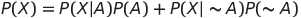
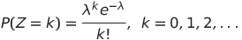
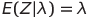
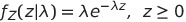
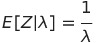
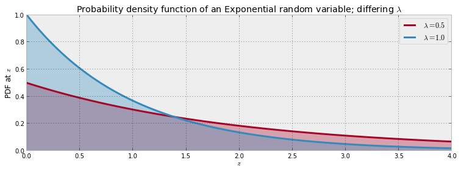

Notes on Chapter 1  
========================================

## The Philosophy of Bayesian Inference

**先验概率**: 我们对于某个事物的belief，称为prior probability  
**后验概率**: 在先验概率基础上，经过一些evidence之后，updated belief称为posterior probability  
> The Frequentist inference function would return a number, whereas the Bayesian function would return probabilities.  

## 贝叶斯推断
  

  

**bernoulli分布**: 0-1分布  
**beta分布**: 作为bernoulli分布的密度函数，先验共轭函数  

## 概率分布

随机变量分为3种: 离散值、连续值、混合值  

离散值的分布称为 probability mass function (PMF)  
连续值的分布称为 probability density function (PDF)  

常见的离散值分布:  
Poisson分布:  
  

  

  

常见的连续值分布  
Exponential分布:  

  

  

 

## Inferring behavior from text-message data

    # 假设短信数据分布符合泊松分布, 且E(C|λ) = λ
    observation = mc.Poisson( "obs", lambda_, value = count_data, observed = True)

    #泊松分布的参数λ，我们假设有一个switch point
    @mc.deterministic
    def lambda_( tau = tau, lambda_1 = lambda_1, lambda_2 = lambda_2 ):
        out = np.zeros( n_count_data ) 
        out[:tau] = lambda_1     #lambda before tau is lambda1
        out[tau:] = lambda_2     #lambda after tau is lambda2
        return out
    
    # 假设λ符合指数分布
    lambda_1 = mc.Exponential( "lambda_1", alpha )
    lambda_2 = mc.Exponential( "lambda_2", alpha )
        
    # E(λ|α) = 1/α; E(C|λ) = λ; E(C) = count_data.mean()    
    alpha = 1.0/count_data.mean()
    
    # P(τ=k)=1/n_count_data    
    tau = mc.DiscreteUniform( "tau", lower = 0, upper = n_count_data )

