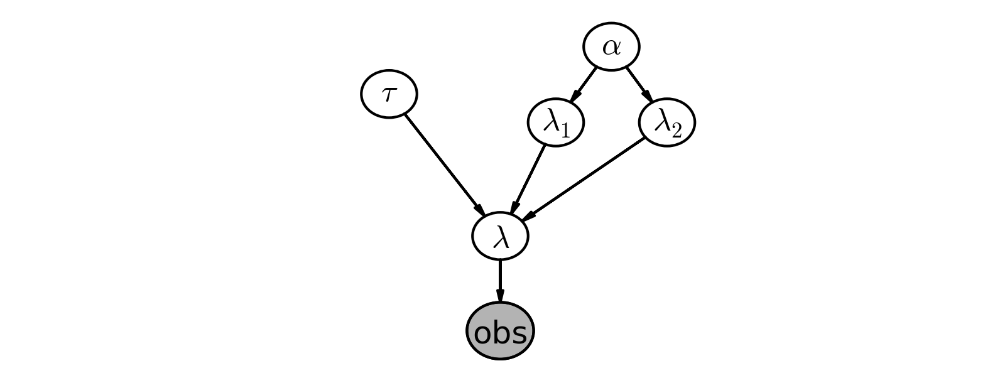

Notes on Chapter 2  
========================================

## Modeling approaches

A good starting thought to Bayesian modeling is to think about how your data might have been generated. Position yourself in an omniscient position, and try to imagine how you would recreate the dataset.  

- We started by thinking "what is the best random variable to describe this count data?" A Poisson random variable is a good candidate because it can represent count data. So we model the number of sms's received as sampled from a Poisson distribution.  

- Next, we think, "Ok, assuming sms's are Poisson-distributed, what do I need for the Poisson distribution?" Well, the Poisson distribution has a parameters λ.  

- Do we know λ? No. In fact, we have a suspicion that there are two λ values, one for the earlier behavior and one for the latter behavior  We don't know when the behavior switches though, but call the switch-point τ.  

- What is a good distribution for the two λs? The exponential is good, as it assigns probabilities to positive real numbers. Well the exponential distribution has a parameter too, call it α.  

- Do we know what the parameter α might be? No. At this point, we could continue and assign a distribution to α, but it's better to stop once we reach a set level of ignorance: whereas we have a prior belief about λ, ("it probably changes over time", "it's likely between 10 and 30", etc.), we don't really have any strong beliefs about α. So it's best to stop here.  

What is a good value for α then? We think that the λs are between 10-30, so if we set α really low (which corresponds to larger probability on high values) we are not reflecting our prior well. Similar, a too-high alpha misses our prior belief as well. A good idea for α as to reflect our belief is to set the value so that the mean of λ, given α, is equal to our observed mean.  

- We have no expert opinion of when τ might have occurred. So we will suppose τ is from a discrete uniform distribution over the entire timespan.  

  
