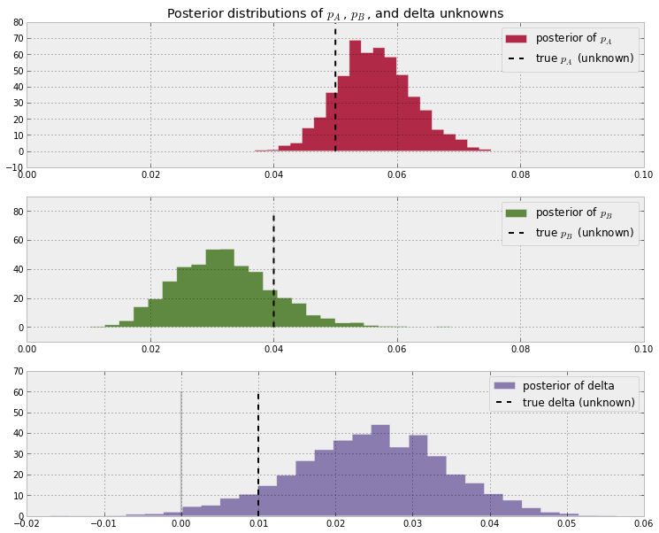

Notes on Chapter 2  
========================================

## Bayesian A/B testing

假设A组数据中，N次试验n次成功，那么A组成功概率P_A是不是就是n/N呢？There is a difference between the observed frequency and the true frequency of an event. We can use Bayesian statistics to infer probable values of the true frequency using an appropriate prior and observed data.  

	# 对于PA我们没有先验概率，所以假设0-1均匀分布
	pa = mc.Uniform('p', lower=0, upper=1 )

	# 假设每次试验是否成功，符合伯努利分布
	obs = mc.Bernoulli( "obs", pa, value = occurrences, observed = True )

根据observation data，求出A和B的后验概率分布，以及delta = P_A - P_B  
 
  

因为B的数据较少，其分布的形状更胖，表示less certain than A
delta > 0的面积大，表示PA > PB的概率更大；根据采样，我们能够获得PA > PB的概率和PA < PB的概率。  
 
如果仅仅使用n/N的话，得出的是一个数值；使用贝叶斯方法可以获得正或负的概率  