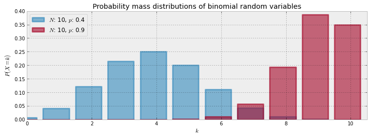

Notes on Chapter 2  
========================================

## 二项式分布  

The binomial distribution has 2 parameters: N, a positive integer representing N trials or number of instances of potential events, and p, the probability of an event occurring in a single trial.  

The expected value of a binomial is equal to Np  

  

The special case when N=1 corresponds to the Bernoulli distribution. There is another connection between Bernoulli and Binomial random variables. If we have X1,X2,...,XN Bernoulli random variables with the same p, then Z=X1+X2+...+XN∼Binomial(N,p).  

## 隐私调查算法

In the interview process for each student, the student flips a coin, hidden from the interviewer. The student agrees to answer honestly if the coin comes up heads. Otherwise, if the coin comes up tails, the student (secretly) flips the coin again, and answers "Yes, I did cheat" if the coin flip lands heads, and "No, I did not cheat", if the coin flip lands tails. This way, the interviewer does not know if a "Yes" was the result of a guilty plea, or a Heads on a second coin toss. Thus privacy is preserved and the researchers receive honest answers.  

P("Yes")=P(Heads on first coin)P(cheater)+P(Tails on first coin)P(Heads on second coin) = P(cheater)*0.5 + 0.25

	# 对于是否作弊假定均匀分布
	p = mc.Uniform( "freq_cheating", 0, 1) 

	# Privacy Algo统计出来的yes次数应该符合binomial分布
	yes_responses = mc.Binomial( "number_cheaters", N, p_skewed, value = 35, observed = True )

	#其中参数p不是均匀分布的p，而是p_skewed，参见上面的公式
	@mc.deterministic
	def p_skewed( p = p ):
	    return 0.5*p + 0.25

 

