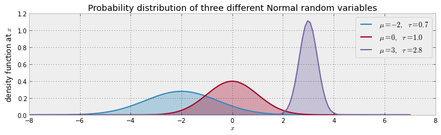
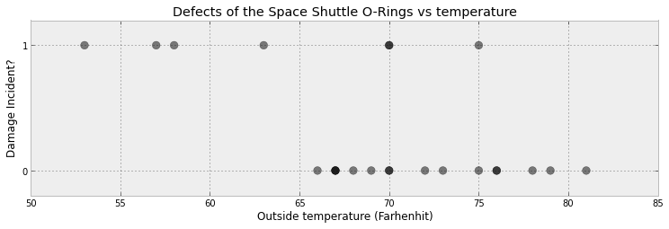
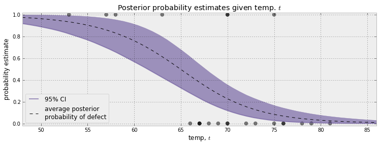

Notes on Chapter 2  
========================================

## 正态分布

  

the expected value of a Normal is equal to its μ parameter, E[X|μ,τ]=μ  
its variance is equal to the inverse of τ: Var(X|μ,τ)=1/τ  
τ越大，方差越小，密度分布越紧凑；τ越小，方差越大，密度分布越广  

## Challenger Space Shuttle Disaster  

  

如果使用分类问题算法，使用logistic regression可以求出一个函数，最好的匹配上面的数据。但是问题是观测出的概率是否就是真实的事件概率呢？  

	#假定故障概率Defect Incident, Di∼Ber(p(ti)),i=1..N
	observed = mc.Bernoulli( "bernoulli_obs", p, value = D, observed=True)

	#概率p(ti)，我们假定是一个logistic函数
	@mc.deterministic
	def p( t = temperature, alpha = alpha, beta = beta):
	    return 1.0/( 1. + np.exp( beta*t + alpha) )	 

	#logistic函数需要alpha和beta两个参数，假定是正态分布（均值为0，方差为1000）
	beta = mc.Normal( "beta", 0, 0.001, value = 0 ) 
	alpha = mc.Normal( "alpha", 0, 0.001, value = 0 )

## 经过MC过程，获得采样值，该如何解读？  

### Confidence Interval

mquantiles，分位数  
Even-sized population  

Consider an ordered population of 10 data values {3, 6, 7, 8, 8, 10, 13, 15, 16, 20}  

- The rank of the first quartile is 10×(1/4) = 2.5, which rounds up to 3, meaning that 3 is the rank in the population (from least to greatest values) at which approximately 1/4 of the values are less than the value of the first quartile. The third value in the population is 7.  
- The rank of the second quartile (same as the median) is 10×(2/4) = 5, which is an integer, while the number of values (10) is an even number, so the average of both the fifth and sixth values is taken—that is (8+10)/2 = 9, though any value from 8 through to 10 could be taken to be the median.  
- The rank of the third quartile is 10×(3/4) = 7.5, which rounds up to 8. The eighth value in the population is 15.  

Odd-sized population  

Consider an ordered population of 11 data values {3, 6, 7, 8, 8, 9, 10, 13, 15, 16, 20}.  

- The first quartile is determined by 11×(1/4) = 2.75, which rounds up to 3, meaning that 3 is the rank in the population (from least to greatest values) at which approximately 1/4 of the values are less than the value of the first quartile. The third value in the population is 7.  
- The second quartile value (same as the median) is determined by 11×(2/4) = 5.5, which rounds up to 6. Therefore 6 is the rank in the population (from least to greatest values) at which approximately 2/4 of the values are less than the value of the second quartile (or median). The sixth value in the population is 9.  
- The third quartile value for the original example above is determined by 11×(3/4) = 8.25, which rounds up to 9. The ninth value in the population is 15.  

  
For example, at 65 degrees, we can be 95% sure that the probability of defect lies between 0.25 and 0.75.  
与普通ML不同，不单纯使cost function最优，而是求出在方差允许范围内所有解，在这些解中，求出前95%的范围。不是给出确定解的值，而是给出一个概率范围。Similarly, when reporting to scientists your estimates, you should be very cautious about simply telling them the expected probability, as we can see this does not reflect how wide the posterior distribution is.  
