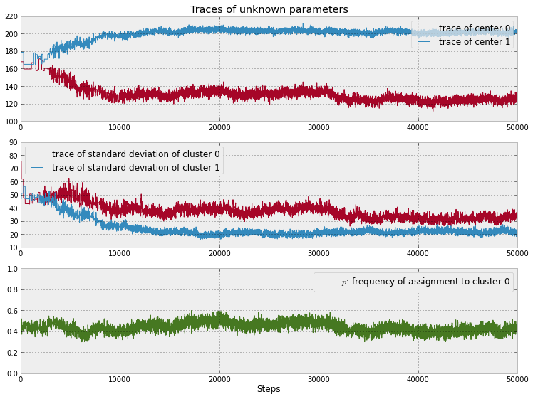

Notes on Chapter 3  
========================================

## Algorithms to perform MCMC  
1.  Start at current position.  
2.  Propose moving to a new position (investigate a pebble near you).  
3.  Accept/Reject the new position based on the position's adherence to the data and prior distributions (ask if the pebble likely came from the mountain).  
4.  \-  If you accept: Move to the new position. Return to Step 1.  
    \-  Else: Do not move to new position. Return to Step 1.  
5.  After a large number of iterations, return all accepted positions.  

## Unsupervised Clustering using a Mixture Model

  

1.  For each data point, choose cluster 1 with probability p, else choose cluster 2.  
2.  Draw a random variate from a Normal distribution with parameters μi and σi where i was chosen in step 1.  
3.  Repeat.  

	# 假定两个cluster的数据都是正态分布
	observations = mc.Normal( "obs", center_i, tau_i, value = data, observed = True )

	# size=2，返回2个序列
	taus = 1.0/mc.Uniform( "stds", 0, 100, size= 2)**2 
	centers = mc.Normal( "centers", [120, 190], [0.01, 0.01], size =2 )
	# 下面2个函数，根据assignment的0或1，在上面2个序列中选择一个填入center_i和tau_i
	@mc.deterministic 
	def center_i( assignment = assignment, centers = centers ):
	        return centers[ assignment] 

	@mc.deterministic
	def tau_i( assignment = assignment, taus = taus ):
	        return taus[ assignment] 

	# Categorical stochastic variable
	# Its parameter is a k-length array of probabilities that must sum to one 
	# and its value attribute is a integer between 0 and k−1 randomly chosen according to the crafted array of probabilities.
	# (In our case k=2)
	assignment = mc.Categorical( "assignment", [p, 1-p], size = data.shape[0] )
	# 每个数据点属于cluster 1 和cluster 2的概率
	p = mc.Uniform( "p", 0, 1)

画出前5万次采样的结果  

  

1.  The traces converges, not to a single point, but to a distribution of possible points. This is convergence in an MCMC algorithm.
2.  Inference using the first few thousand points is a bad idea, as they are unrelated to the final distribution we are interested in. Thus is it a good idea to discard those samples before using the samples for inference. We call this period before converge the burn-in period.
3.  The traces appear as a random "walk" around the space, that is, the paths exhibit correlation with previous positions. This is both good and bad. We will always have correlation between current positions and the previous positions, but too much of it means we are not exploring the space well. 

如果觉得收敛不够，就增加采样次数  

## Cluster Investigation  

	assignment = mc.Categorical("assignment", [p, 1-p], size = data.shape[0] ) 

	assign_trace = mcmc.trace("assignment")[:]      ## 采样集合，每个采样是size = data.shape[0]的2个序列，[p和1-p]的序列

	assign_trace.mean(axis=0)        ## 1表示属于cluster 2，均值就是n/N，属于cluster2的概率，axis=0是采样的轴

  
 
How can we choose just a single pair of values for the mean and variance and determine a sorta-best-fit gaussian?  
One quick and dirty way (which has nice theoretical properties we will see in Chapter 5), is to use the mean of the posterior distributions.  

  

### Important: Don't mix posterior samples  

Thus the two standard deviations aredependent on each other: if one is small, the other must be large. In fact, all the unknowns are related in a similar manner. It would be wrong to add the ith sample of x to the jth sample of y, unless i=j.  

### Returning to Clustering: Prediction

  

  

  

 	x = 175
	v = p_trace*norm_pdf(x, loc = center_trace[:,0], scale = std_trace[:,0] ) \
	        > (1-p_trace)*norm_pdf(x, loc = center_trace[:,1], scale = std_trace[:,1] ) 

	print "Probability of belonging to cluster 1:", v.mean()

 

### Using MAP to improve convergence

In fact, poor starting values can prevent any convergence, or significantly slow it down. Ideally, we would like to have the chain start at the peak of our landscape, as this is exactly where the posterior distributions exist. Hence, if we started at the "peak", we could avoid a lengthy burn-in period and incorrect inference. Generally, we call this "peak" the maximum a posterior or, more simply, the MAP.  

	map_ = mc.MAP( model )
	map_.fit()

From my experience, I use the default, but if my convergence is slow or not guaranteed, I experiment with Powell's method, by calling fit(method='fmin_powell').   

The MAP can also be used as a solution to the inference problem, as mathematically it is the most likely value for the unknowns. But as mentioned before, this location ignores the uncertainty and doesn't return a distribution.  

### Speaking of the burn-in period

It is still a good idea to provide a burn-in period, even if we are using MAP prior to calling MCMC.sample, just to be safe. We can have PyMC automatically discard the first n samples by specifying the burn parameter in the call to sample. As one does not know when the chain has fully converged, I like to assign the first half of my samples to be discarded, sometimes up to 90% of my samples for longer runs.
