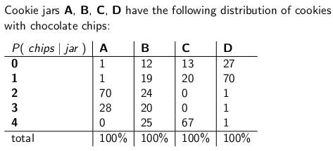

Notes on Chapter 3  
========================================

## 自相关性  

对于一个序列，如果随机误差项的各期望值之间存在着相关关系，这时称随机误差项之间存在自相关性  

  

  

随着k的增加，相关性逐渐减少，说明序列y存在自相关性。如果MCMC的采样点自相关性很高，则不利于结果的收敛。低自相关性不是收敛的必要条件，但是充分条件。为了增加各个采样的独立性，可以采用稀释手段，即sample函数的thinning参数  

  

## pymc.Matplot.plot()

  

The interval between the two dashed vertical lines in each the posterior distributions represent the 95% credible interval, not to be confused with a 95% confidence interval. I won't get into the latter, but the former can be interpreted as "there is a 95% chance the parameter of interested lies in this interval". (Changing default parameters in the call to mcplot provides alternatives to 95%.) When communicating your results to others, it is incredibly important to state this interval.

### Credible Interval vs Confidence Interval

credible interval是基于概率分布的；confidence interval是基于数据采样的。  
credible interval表达了我们对于true value的区间的不确定性；confidence interval表达了我们对于区间正确性的信心。  

> When I was a child my mother used to occasionally surprise me by ordering a jar of chocolate-chip cookies to be delivered by mail. The delivery company stocked four different kinds of cookie jars -- type A, type B, type C, and type D, and they were all on the same truck and you were never sure what type you would get. Each jar had exactly 100 cookies, but the feature that distinguished the different cookie jars was their respective distributions of chocolate chips per cookie. If you reached into a jar and took out a single cookie uniformly at random, these are the probability distributions you would get on the number of chips:  

  

> A type-A cookie jar, for example, has 70 cookies with two chips each, and no cookies with four chips or more! A type-D cookie jar has 70 cookies with one chip each. Notice how each vertical column is a probability mass function -- the conditional probability of the number of chips you'd get, given that the jar = A, or B, or C, or D, and each column sums to 100.  

> I used to love to play a game as soon as the deliveryman dropped off my new cookie jar. I'd pull one single cookie at random from the jar, count the chips on the cookie, and try to express my uncertainty -- at the 70% level -- of which jars it could be. Thus it's the identity of the jar (A, B, C or D) that is the value of the parameter being estimated. The number of chips (0, 1, 2, 3 or 4) is the outcome or the observation or the sample.  

> Originally I played this game using a frequentist, 70% confidence interval. Such an interval needs to make sure that no matter the true value of the parameter, meaning no matter which cookie jar I got, the interval would cover that true value with at least 70% probability.  

> An interval, of course, is a function that relates an outcome (a row) to a set of values of the parameter (a set of columns). But to construct the confidence interval and guarantee 70% coverage, we need to work "vertically" -- looking at each column in turn, and making sure that 70% of the probability mass function is covered so that 70% of the time, that column's identity will be part of the interval that results. Remember that it's the vertical columns that form a p.m.f.  

> So after doing that procedure, I ended up with these intervals:  

  

> For example, if the number of chips on the cookie I draw is 1, my confidence interval will be {B,C,D}. If the number is 4, my confidence interval will be {B,C}. Notice that since each column sums to 70% or greater, then no matter which column we are truly in (no matter which jar the deliveryman dropped off), the interval resulting from this procedure will include the correct jar with at least 70% probability.  

> Notice also that the procedure I followed in constructing the intervals had some discretion. In the column for type-B, I could have just as easily made sure that the intervals that included B would be 0,1,2,3 instead of 1,2,3,4. That would have resulted in 75% coverage for type-B jars (12+19+24+20), still meeting the lower bound of 70%.  

> My sister Bayesia thought this approach was crazy, though. "You have to consider the deliverman as part of the system," she said. "Let's treat the identity of the jar as a random variable itself, and let's assume that the deliverman chooses among them uniformly -- meaning he has all four on his truck, and when he gets to our house he picks one at random, each with uniform probability."  

> "With that assumption, now let's look at the joint probabilities of the whole event -- the jar type and the number of chips you draw from your first cookie," she said, drawing the following table:  

  

> Notice that the whole table is now a probability mass function -- meaning the whole table sums to 100%.  

> "Ok," I said, "where are you headed with this?"  

> "You've been looking at the conditional probability of the number of chips, given the jar," said Bayesia. "That's all wrong! What you really care about is the conditional probability of which jar it is, given the number of chips on the cookie! Your 70% interval should simply include the list jars that, in total, have 70% probability of being the true jar. Isn't that a lot simpler and more intuitive?"  

> "Sure, but how do we calculate that?" I asked.  

> "Let's say we know that you got 3 chips. Then we can ignore all the other rows in the table, and simply treat that row as a probability mass function. We'll need to scale up the probabilities proportionately so each row sums to 100, though." She did:  

  

> "Notice how each row is now a p.m.f., and sums to 100%. We've flipped the conditional probability from what you started with -- now it's the probability of the man having dropped off a certain jar, given the number of chips on the first cookie."  

> "Interesting," I said. "So now we just circle enough jars in each row to get up to 70% probability?" We did just that, making these credibility intervals:  

  

> Each interval includes a set of jars that, a posteriori, sum to 70% probability of being the true jar.  

> "Well, hang on," I said. "I'm not convinced. Let's put the two kinds of intervals side-by-side and compare them for coverage and, assuming that the deliveryman picks each kind of jar with equal probability, credibility."  

> Here they are:  

> Confidence intervals:  

  

> Credibility intervals:  

  

> "See how crazy your confidence intervals are?" said Bayesia. "You don't even have a sensible answer when you draw a cookie with zero chips! You just say it's the empty interval. But that's obviously wrong -- it has to be one of the four types of jars. How can you live with yourself, stating an interval at the end of the day when you know the interval is wrong? And ditto when you pull a cookie with 3 chips -- your interval is only correct 41% of the time. Calling this a '70%' confidence interval is bullshit."  

> "Well, hey," I replied. "It's correct 70% of the time, no matter which jar the deliveryman dropped off. That's a lot more than you can say about your credibility intervals. What if the jar is type B? Then your interval will be wrong 80% of the time, and only correct 20% of the time!"  

> "This seems like a big problem," I continued, "because your mistakes will be correlated with the type of jar. If you send out 100 'Bayesian' robots to assess what type of jar you have, each robot sampling one cookie, you're telling me that on type-B days, you will expect 80 of the robots to get the wrong answer, each having >73% belief in its incorrect conclusion! That's troublesome, especially if you want most of the robots to agree on the right answer."  

> "PLUS we had to make this assumption that the deliveryman behaves uniformly and selects each type of jar at random," I said. "Where did that come from? What if it's wrong? You haven't talked to him; you haven't interviewed him. Yet all your statements of a posteriori probability rest on this statement about his behavior. I didn't have to make any such assumptions, and my interval meets its criterion even in the worst case."  

> "It's true that my credibility interval does perform poorly on type-B jars," Bayesia said. "But so what? Type B jars happen only 25% of the time. It's balanced out by my good coverage of type A, C, and D jars. And I never publish nonsense."  

> "It's true that my confidence interval does perform poorly when I've drawn a cookie with zero chips," I said. "But so what? Chipless cookies happen, at most, 27% of the time in the worst case (a type-D jar). I can afford to give nonsense for this outcome because NO jar will result in a wrong answer more than 30% of the time."  

> "The column sums matter," I said.  

> "The row sums matter," Bayesia said.  

> "I can see we're at an impasse," I said. "We're both correct in the mathematical statements we're making, but we disagree about the appropriate way to quantify uncertainty."  

> "That's true," said my sister. "Want a cookie?"  

## The Folk Theorem of Statistical Computing

> If you are having computational problems, probably your model is wrong.  
For this reason, it is best to carefully choose the priors. Often, lack of covergence or evidence of samples crowding to boundaries implies something is wrong with the chosen priors.
