Notes on Chapter 4  
========================================

## The Law of Large Numbers

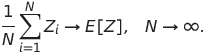  

随机数序列Z的期望值收敛于Z的均值

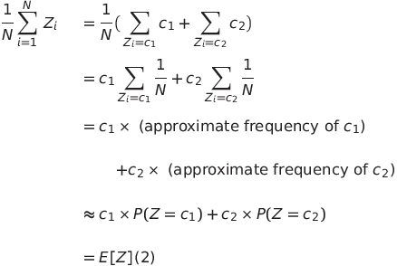  

随着采样的增加，均值和期望值逐渐收敛。

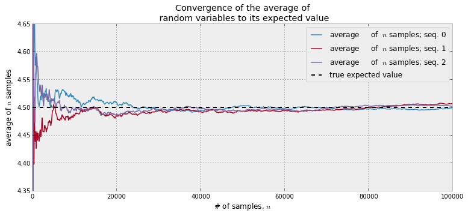  

## 收敛的速率

the rate of convergence: 

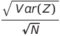  

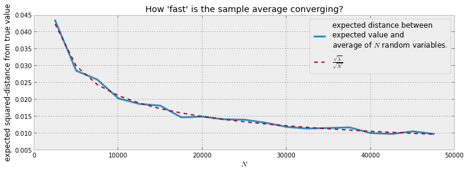  

**如何计算Var(Z)?**

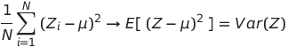  

## 期望值和概率值  
假设函数： 

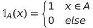  

那么： 

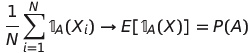  

所以： 

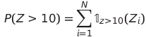  

## How Reddit ranks comments  
1.  **Popularity**: A comment is considered good if it has many upvotes. A problem with this model is that a comment with hundreds of upvotes, but thousands of downvotes. While being very popular, the comment is likely more controversial than best.  
2.  **Difference**: Using the difference of upvotes and downvotes. This solves the above problem, but fails when we consider the temporal nature of comments. Comments can be posted many hours after the original link submission. The difference method will bias the Top comments to be the oldest comments, which have accumulated more upvotes than newer comments, but are not necessarily the best.
3.  **Time adjusted**: Consider using Difference divided by the age of the comment. This creates a rate, something like difference per second, or per minute. An immediate counter example is, if we use per second, a 1 second old comment with 1 upvote would be better than a 100 second old comment with 99 upvotes. One can avoid this by only considering at least t second old comments. But what is a good t value? Does this mean no comment younger than t is good? We end up comparing unstable quantities with stable quantities (young vs. old comments).
4.  **Ratio**: Rank comments by the ratio of upvotes to total number of votes (upvotes plus downvotes). This solves the temporal issue, such that new comments who score well can be considered Top just as likely as older comments, provided they have many upvotes to total votes. The problem here is that a comment with a single upvote (ratio = 1.0) will beat a comment with 999 upvotes and 1 downvote (ratio = 0.999), but clearly the latter comment is more likely to be better.  
  
  
  
1.  **Skewed data**: The vast majority of comments have very few votes, hence there will be many comments with ratios near the extremes (see the "triangular plot" in the above Kaggle dataset), effectively skewing our distribution to the extremes. One could try to only use comments with votes greater than some threshold. Again, problems are encountered. There is a tradeoff between number of comments available to use and a higher threshold with associated ratio precision.  
2.  **Biased data**: Reddit is composed of different subpages, called subreddits. Two examples are r/aww, which posts pics of cute animals, and r/politics. It is very likely that the user behaviour towards comments of these two subreddits are very different: visitors are likely friendly and affectionate in the former, and would therefore upvote comments more, compared to the latter, where comments are likely to be controversial and disagreed upon. Therefore not all comments are the same.
  
代码:  

    # up和down的分布符合二项式分布
    observations = mc.Binomial( "obs", N, upvote_ratio, value = upvotes, observed = True) 
     
    N = upvotes + downvotes
     
    # 由于没有合适的upvote先验，所以采样均匀分布
    upvote_ratio = mc.Uniform( "upvote_ratio", 0, 1 ) 

    # 求出每个评论的分布之后，使用95% least plausible value进行排序
    # think of the lower bound on the 95% credible region
    v = np.sort( posteriors[i] )[ int(0.05*N) ]
 

Why is sorting based on this quantity a good idea? By ordering by the 95% least plausible value, we are being the most conservative with what we think is best. That is, even in the worst case scenario, when we have severely overestimated the upvote ratio, we can be sure the best comments are still on top.

- given two comments with the same observed upvote ratio, we will assign the comment with more votes as better (since we are more confident it has a higher ratio).
- given two comments with the same number of votes, we still assign the comment with more upvotes as better.

## Derivation of sorting comments formula  

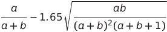  

where  

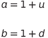  

u is the number of upvotes, and d is the number of downvotes.  

假定up和down的分布符合beta分布，且N = u + d，则beta需要的两个参数a和b为：  
a = 1 + u  
b = 1 + N - u = 1 + d  

使用正态分布去估计x  

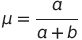  

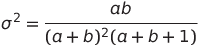  

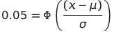  

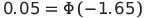  
