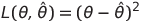
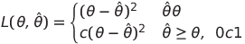
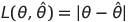
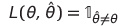
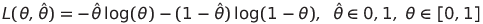
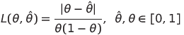
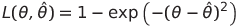
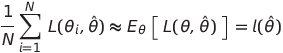

Notes on Chapter 5  
========================================

## Loss Functions

### squared-error loss  

  

### asymmetric squared-error loss function  

  

This represents that estimating a value larger than the true estimate is preferable to estimating a value below.  

### absolute-loss  

  

### zero-one loss  

  

### log-loss  

  

### other loss functions:  

  

This function emphasizes an estimate closer to 0 or 1 since if the true value θ is near 0 or 1, the loss will be very large unless θ^ is similarly close to 0 or 1.  

  

This function is bounded between 0 and 1 and reflects that the user is indifferent to sufficiently-far-away estimates. It is similar to the zero-one loss above, but not quite as penalizing to estimates that are close to the true parameter.  

## The risk of estimate θ^

  

